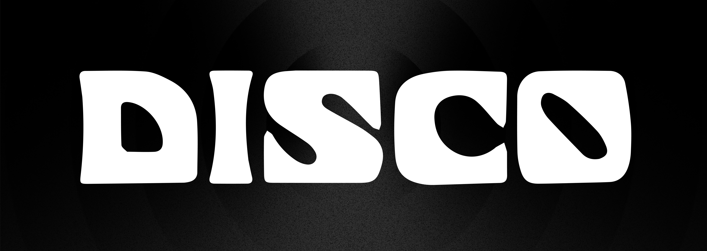

<div align="center">
  

  [](https://opensource.org/licenses/Apache-2.0)
  [](https://badge.fury.io/js/@stackone%2Fmcp-connectors)
  [](https://badge.fury.io/js/@stackone%2Fmcp-config-types)

> Pre-built MCP connectors for popular SaaS tools - powers [disco.dev](https://disco.dev)

</div>

## Features

This monorepo contains two packages built with TypeScript and Zod:

**@stackone/mcp-connectors** - Pre-built connectors for popular SaaS tools

- 35+ production-ready MCP connectors
- Typesafe wrapper around MCP capabilities
- Local development with auto-reload
- No dependencies on server runtime or transport
- Runs on Bun, Node, and Cloudflare Workers

**@stackone/mcp-config-types** - Shared configuration types

- Zod schemas for connector credentials and setup fields
- TypeScript types for all connector configurations
- Designed for AI coding agents (Claude, Cursor, etc.)
- Enables type-safe connector development

## Usage

### For End Users

The MCP connectors in this repo power [**disco.dev**](https://disco.dev) - the easiest way to connect your favourite tools to your favourite AI applications using the Model Context Protocol.

Go to [disco.dev](https://disco.dev) to get started with zero setup.

### For Developers

Use these packages to build your own MCP servers:

```bash
npm install @stackone/mcp-connectors @stackone/mcp-config-types
```

The connectors can be imported and used in your own MCP server implementations, and the config types provide TypeScript definitions for all connector configurations.

## Getting Started (First Time Setup)

If you want to run the connectors locally or contribute to the project:

1. **Clone the repository:**

   ```bash
   git clone https://github.com/stackone-ai/mcp-connectors.git
   cd mcp-connectors
   ```

2. **Install Bun** (if you don't have it already):

   ```bash
   curl -fsSL https://bun.sh/install | bash
   ```

3. **Install dependencies:**

   ```bash
   bun install
   ```

4. **Build the project:**

   ```bash
   bun run build
   ```

5. **Run the tests:**

   ```bash
   bun test
   ```

5. **Check out the documentation:**
   - See the [`docs/`](./docs/) directory for detailed guides
   - Start with [Running Locally](./docs/running-locally.md) for setup instructions
   - Read [Writing Connectors](./docs/writing-connectors.md) to create your own

## Usage

This is a monorepo managed with Bun and Turbo.

### Start a server from a connector

No credentials needed:

```bash
# Start a test server in the background
bun run server -- -- --connector test
bun run server -- -- --connector documentation

# Start with credentials (credentials object schema may be different for each connector)
bun run server -- -- --connector github --credentials '{"token":"ghp_xxx"}'
```

Server runs at `http://localhost:3000/mcp`

### Package structure

- `packages/mcp-connectors/` - The main connectors package
- `packages/mcp-config-types/` - Shared configuration types

## Available Connectors

**Popular integrations:** `asana`, `github`, `slack`, `notion`, `jira`, `linear`, `todoist`, `google-drive`, `supabase`

**Full list:** Run `bun start --help` to see all 35+ connectors

## Documentation

- [Writing Connectors](./docs/writing-connectors.md) - How to write a connector
- [Running Locally](./docs/running-locally.md) - Detailed setup and configuration

## License

Apache 2.0 - see [LICENSE](LICENSE)

## Inspiration

> "Everything is just fetch wrapped in a function, delivered in pure typescript."

The typing in this package is heavily inspired by the [AI SDK by Vercel](https://github.com/vercel/ai) and the development process has been influenced by the work of Sam at [Alchemy](https://alchemy.run).

---

**Built by [StackOne](https://stackone.com) • Powers [disco.dev](https://disco.dev)**
